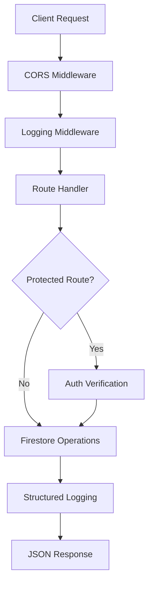

# E-Commerce Backend Documentation

## Overview

The backend is a FastAPI application that serves as the REST API for the e-commerce platform. It handles user authentication, product management, shopping cart operations, and order processing using Google Cloud Firestore as the database.

### Tech Stack
- **Framework**: FastAPI (Python 3.11+)
- **Server**: Uvicorn (ASGI)
- **Database**: Google Cloud Firestore
- **Authentication**: Firebase Authentication
- **Logging**: Google Cloud Logging (structured JSON)
- **Deployment**: Google Cloud Run
- **Containerization**: Docker

## Architecture

### Application Structure

```
backend/
├── main.py                          # FastAPI application entry point
├── config.py                        # Environment configuration
├── firestore.py                     # Firestore client and helpers
├── requirements.txt                 # Python dependencies
├── Dockerfile                       # Container configuration
├── .env.template                    # Environment variables template
├── middleware/
│   ├── auth.py                      # Firebase token verification
│   └── logging.py                   # Request/response logging
├── routes/
│   ├── auth.py                      # Authentication endpoints
│   ├── products.py                  # Product endpoints
│   ├── cart.py                      # Shopping cart endpoints
│   └── orders.py                    # Order endpoints
├── models/
│   ├── schemas.py                   # Pydantic request/response models
│   └── user.py                      # User utility functions
├── utils/
│   └── logger.py                    # Structured logging utilities
├── scripts/
│   └── import_products.py           # CSV to Firestore import script
├── data/
│   └── products.csv                 # Product data file
└── docs/
    └── api-validation.json          # API endpoint validation document
```

### Architecture Flow



## Local Setup

### Prerequisites

- Python 3.11+
- pip (Python package manager)
- Google Cloud project with Firestore enabled
- Firebase project configuration
- Service account credentials (JSON key file)

### Installation

1. **Clone the repository**
```bash
cd backend
```

2. **Create virtual environment**
```bash
python -m venv venv
source venv/bin/activate  # On Windows: venv\Scripts\activate
```

3. **Install dependencies**
```bash
pip install -r requirements.txt
```

4. **Setup environment variables**
```bash
cp .env.template .env
# Edit .env with your Firebase configuration
```

5. **Place service account credentials**
```bash
# Download from Firebase Console > Project Settings > Service Accounts
cp /path/to/service-account.json service-account.json
```

6. **Run development server**
```bash
uvicorn main:app --reload --port 8080
```

Server will be available at `http://localhost:8080`

## API Endpoints

### Base URL
- Local: `http://localhost:8080`
- Production: `https://ecommerce-backend-[region].run.app`

### Authentication Required
Protected endpoints require Firebase ID token in Authorization header:
```
Authorization: Bearer {firebase_id_token}
```

### Health & Status

#### Health Check
```
GET /health
```
**Response**: `200 OK`
```json
{
  "status": "healthy",
  "service": "ecommerce-backend"
}
```

#### Readiness Check
```
GET /ready
```
Verifies Firestore connection is working.
**Response**: `200 OK` or `503 Service Unavailable`

---

### Authentication Routes
**Prefix**: `/auth`

#### Get Current User Profile
```
GET /auth/me
Auth Required: YES
```
**Response**: `200 OK`
```json
{
  "uid": "firebase_uid",
  "email": "user@example.com",
  "firstname": "John",
  "lastname": "Doe",
  "mobilenumber": "1234567890"
}
```

#### Create/Update User Profile
```
POST /auth/profile
Auth Required: YES
Content-Type: application/json
```
**Request Body**:
```json
{
  "firstname": "John",
  "lastname": "Doe",
  "mobilenumber": "1234567890"
}
```
**Response**: `200 OK`
```json
{
  "message": "Profile updated successfully"
}
```

---

### Product Routes
**Prefix**: `/products`

#### List All Products
```
GET /products
Auth Required: NO
```
**Query Parameters**:
- `limit` (optional): Number of products to return (default: 50)
- `offset` (optional): Pagination offset (default: 0)

**Response**: `200 OK`
```json
[
  {
    "id": "product_id",
    "name": "Wireless Mouse",
    "description": "Ergonomic wireless mouse",
    "price": 899,
    "image_url": "https://example.com/image.jpg",
    "stock": 50,
    "category": "Electronics"
  }
]
```

#### Get Product Details
```
GET /products/{product_id}
Auth Required: NO
```
**Response**: `200 OK`
```json
{
  "id": "product_id",
  "name": "Wireless Mouse",
  "description": "Ergonomic wireless mouse with 2.4GHz connectivity",
  "price": 899,
  "image_url": "https://example.com/image.jpg",
  "stock": 50,
  "category": "Electronics",
  "created_at": "2024-01-15T10:30:00Z"
}
```

**Error**: `404 Not Found`
```json
{
  "detail": "Product not found"
}
```

---

### Cart Routes
**Prefix**: `/cart`

#### Get User Cart
```
GET /cart
Auth Required: YES
```
**Response**: `200 OK`
```json
{
  "items": [
    {
      "product_id": "prod_1",
      "name": "Wireless Mouse",
      "price": 899,
      "quantity": 2,
      "image_url": "https://example.com/image.jpg"
    }
  ],
  "total_items": 1,
  "total_amount": 1798
}
```

#### Add Item to Cart
```
POST /cart/add
Auth Required: YES
Content-Type: application/json
```
**Request Body**:
```json
{
  "product_id": "prod_1",
  "quantity": 1
}
```
**Response**: `200 OK`
```json
{
  "message": "Item added to cart",
  "cart_total": 1798
}
```

#### Remove Item from Cart
```
POST /cart/remove
Auth Required: YES
Content-Type: application/json
```
**Request Body**:
```json
{
  "product_id": "prod_1"
}
```
**Response**: `200 OK`
```json
{
  "message": "Item removed from cart"
}
```

#### Update Cart Item Quantity
```
POST /cart/update
Auth Required: YES
Content-Type: application/json
```
**Request Body**:
```json
{
  "product_id": "prod_1",
  "quantity": 5
}
```
**Response**: `200 OK`
```json
{
  "message": "Cart updated"
}
```

---

### Order Routes
**Prefix**: `/orders`

#### Place Order
```
POST /orders/place
Auth Required: YES
Content-Type: application/json
```
**Request Body**: (empty or minimal)
```json
{}
```
**Response**: `200 OK`
```json
{
  "message": "Order placed successfully",
  "order_id": "order_abc123",
  "total_amount": 1798
}
```

**Error**: `400 Bad Request`
```json
{
  "detail": "Cart is empty"
}
```

#### Get User Orders
```
GET /orders
Auth Required: YES
```
**Response**: `200 OK`
```json
[
  {
    "id": "order_abc123",
    "items": [
      {
        "product_id": "prod_1",
        "name": "Wireless Mouse",
        "quantity": 2,
        "price": 899
      }
    ],
    "total_amount": 1798,
    "status": "PLACED",
    "created_at": "2024-01-15T14:30:00Z"
  }
]
```

---

## Firestore Database Schema

### Collections

#### users
```
Collection: users
Document ID: {firebase_uid}

Fields:
  email: string
  firstname: string
  lastname: string
  mobilenumber: string
  created_at: timestamp
  updated_at: timestamp
```

#### products
```
Collection: products
Document ID: auto-generated

Fields:
  name: string
  description: string
  price: number
  image_url: string
  stock: number
  category: string
  created_at: timestamp
```

#### carts
```
Collection: carts
Document ID: {firebase_uid}

Fields:
  uid: string
  items: array[
    {
      product_id: string
      name: string
      price: number
      quantity: number
      image_url: string
    }
  ]
  updated_at: timestamp
```

#### orders
```
Collection: orders
Document ID: auto-generated

Fields:
  uid: string
  items: array[
    {
      product_id: string
      name: string
      quantity: number
      price: number
    }
  ]
  total_amount: number
  status: string (PLACED, PROCESSING, SHIPPED, DELIVERED)
  created_at: timestamp
  updated_at: timestamp
```

---

## Authentication & Authorization

### Firebase ID Token Verification

All protected routes verify Firebase ID tokens:

1. Client sends token in Authorization header: `Authorization: Bearer {token}`
2. Backend middleware (`middleware/auth.py`) extracts and verifies token
3. Token claims include Firebase UID and email
4. User context passed to route handler

### Protected Routes

- `GET /auth/me`
- `POST /auth/profile`
- `GET /cart`
- `POST /cart/add`
- `POST /cart/remove`
- `POST /cart/update`
- `POST /orders/place`
- `GET /orders`

### Public Routes

- `GET /` (root)
- `GET /health`
- `GET /ready`
- `GET /products`
- `GET /products/{product_id}`

---

## Logging & Monitoring

### Structured Logging

All logs are structured JSON for easy parsing in Cloud Logging:

```json
{
  "type": "api_request",
  "endpoint": "/products",
  "method": "GET",
  "status_code": 200,
  "duration_ms": 45.2,
  "timestamp": "2024-01-15T10:30:00Z",
  "user_id": "firebase_uid"
}
```

### Log Types

- **api_request**: HTTP request/response
- **error**: Application errors
- **database**: Firestore operations
- **auth**: Authentication events

### Accessing Logs

In Google Cloud Console:
```
service="ecommerce-backend"
AND severity >= ERROR
```

---

## Error Handling

### Error Response Format

```json
{
  "detail": "Error message"
}
```

### Common Status Codes

- `200 OK`: Successful request
- `400 Bad Request`: Invalid input
- `401 Unauthorized`: Missing/invalid token
- `404 Not Found`: Resource not found
- `500 Internal Server Error`: Server error

---

## Testing

### Using cURL

**List products**:
```bash
curl -X GET http://localhost:8080/products
```

**Get current user (requires token)**:
```bash
curl -X GET \
  -H "Authorization: Bearer YOUR_FIREBASE_TOKEN" \
  http://localhost:8080/auth/me
```

**Add to cart**:
```bash
curl -X POST \
  -H "Authorization: Bearer YOUR_FIREBASE_TOKEN" \
  -H "Content-Type: application/json" \
  -d '{"product_id": "prod_1", "quantity": 1}' \
  http://localhost:8080/cart/add
```

### Using Postman

1. Import API collection from `docs/api-validation.json`
2. Set environment variables (token, base_url)
3. Run test requests

---

## Configuration

### Environment Variables

See `.env.template` for all configuration options:

- `ENVIRONMENT`: development or production
- `FIREBASE_PROJECT_ID`: Your Firebase project ID
- `GOOGLE_APPLICATION_CREDENTIALS`: Path to service account JSON
- `CORS_ORIGINS`: Comma-separated list of allowed origins

### Secrets Management (Production)

In production, use Google Secret Manager:

```bash
# Store service account key
gcloud secrets create service-account-key \
  --data-file=service-account.json

# Cloud Run automatically mounts secrets
```

---

## Deployment

See [DEPLOY_BACKEND.md](./DEPLOY_BACKEND.md) for detailed deployment instructions.

### Quick Deployment

```bash
gcloud run deploy ecommerce-backend \
  --source . \
  --project test-99u1b3 \
  --region asia-south1 \
  --allow-unauthenticated
```

---

## Troubleshooting

### Firestore Connection Issues

**Problem**: Requests hang indefinitely
**Solution**:
- Check service account credentials
- Verify Firestore database exists
- Check network connectivity to Google APIs

### Authentication Errors

**Problem**: 401 Unauthorized on protected routes
**Solution**:
- Verify Firebase ID token is valid
- Check Authorization header format
- Token may have expired (refresh on frontend)

### CORS Issues

**Problem**: Browser blocks requests
**Solution**:
- Check CORS_ORIGINS environment variable
- Verify frontend origin is whitelisted
- Check allow_credentials setting

---

## Performance Tips

1. **Enable Firestore Indexes**: Create composite indexes for frequent queries
2. **Cache Products**: Products change infrequently, consider caching
3. **Pagination**: Use limit/offset for large collections
4. **Connection Pooling**: Firestore SDK handles this automatically

---

## Security Best Practices

1. Never commit service account keys
2. Use Google Secret Manager for credentials
3. Always verify Firebase tokens on protected routes
4. Validate all user inputs with Pydantic
5. Use HTTPS in production
6. Enable Firestore security rules
7. Regular security audits

---

## Additional Resources

- [FastAPI Documentation](https://fastapi.tiangolo.com/)
- [Firebase Admin SDK](https://firebase.google.com/docs/database/admin/start)
- [Google Cloud Firestore](https://cloud.google.com/firestore/docs)
- [Google Cloud Run](https://cloud.google.com/run/docs)
