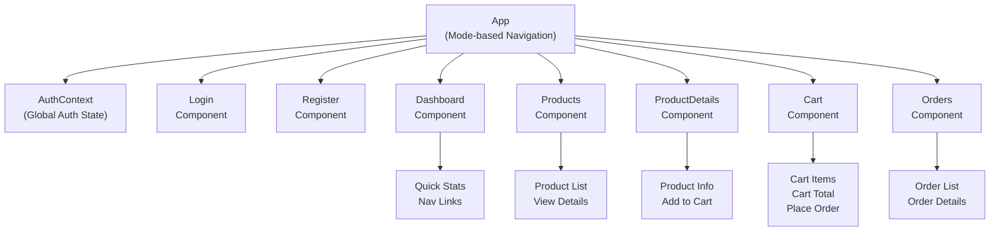
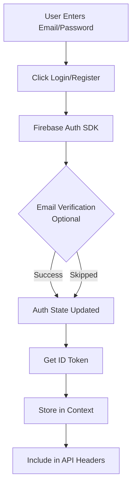
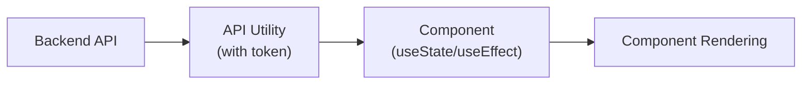

# E-Commerce Frontend Documentation

## Overview

The frontend is a React application that provides the user interface for the e-commerce platform. It handles user authentication via Firebase, product browsing, shopping cart management, and order placement.

### Tech Stack
- **Framework**: React 19.2.3
- **Build Tool**: Create React App (CRA)
- **Authentication**: Firebase Authentication
- **HTTP Client**: Fetch API
- **State Management**: React Context API + Hooks
- **Styling**: CSS-in-JS with inline styles
- **Node Version**: 18+, npm 10+
- **Deployment**: Firebase Hosting

## Architecture

### Application Structure

```
ecommerce-frontend/
├── public/                          # Static assets
│   ├── index.html
│   ├── favicon.ico
│   └── manifest.json
├── src/
│   ├── firebase/
│   │   └── config.js                # Firebase initialization
│   ├── context/
│   │   └── AuthContext.js           # Authentication state management
│   ├── utils/
│   │   └── api.js                   # API utility with token injection
│   ├── components/
│   │   ├── Login.js                 # Login page
│   │   ├── Register.js              # Registration page
│   │   ├── Dashboard.js             # User dashboard
│   │   ├── Products.js              # Product listing
│   │   ├── ProductDetails.js        # Single product view
│   │   ├── Cart.js                  # Shopping cart
│   │   └── Orders.js                # Order history
│   ├── App.js                       # Main app component
│   ├── App.css                      # App styles
│   ├── index.js                     # React entry point
│   ├── index.css                    # Global styles
│   ├── .env                         # Environment variables
│   └── .env.production              # Production env vars
├── firebase.json                    # Firebase Hosting config
├── .firebaserc                      # Firebase project config
├── package.json                     # Dependencies and scripts
└── .gitignore
```

### Component Architecture



## Local Setup

### Prerequisites

- Node.js 18+ and npm 10+
- Firebase project with Authentication enabled
- Backend API running (http://localhost:8080)

### Installation

1. **Navigate to frontend directory**
```bash
cd ecommerce-frontend
```

2. **Install dependencies**
```bash
npm install
```

3. **Create environment file**
```bash
cp .env.template .env
```

4. **Get Firebase configuration**
- Go to Firebase Console > Project Settings > General
- Find "Your apps" section
- Copy config values into `.env`:

```
REACT_APP_API_BASE_URL=http://localhost:8080
REACT_APP_FIREBASE_API_KEY=your_api_key
REACT_APP_FIREBASE_AUTH_DOMAIN=project.firebaseapp.com
REACT_APP_FIREBASE_PROJECT_ID=your_project_id
REACT_APP_FIREBASE_STORAGE_BUCKET=your_bucket.appspot.com
REACT_APP_FIREBASE_MESSAGING_SENDER_ID=your_sender_id
REACT_APP_FIREBASE_APP_ID=your_app_id
```

5. **Start development server**
```bash
npm start
```

Application opens at `http://localhost:3000`

## Component Guide

### App.js (Main Component)

Central component managing:
- Mode-based navigation (login, register, dashboard, products, productDetail, cart, orders)
- Global state for current user
- Firebase Auth status handling
- API integration

**Key State**:
- `currentUser`: Firebase user object
- `authLoading`: Authentication loading state
- `mode`: Current page view
- `selectedProduct`: Currently viewed product details

### AuthContext (Authentication)

Manages all authentication-related state and functions:

**Provides**:
- `user`: Current Firebase user object
- `loading`: Auth initialization loading state
- `idToken`: Current Firebase ID token
- `login(email, password)`: Login user
- `register(email, password, userData)`: Register new user
- `logout()`: Logout user
- `refreshToken()`: Refresh ID token (auto on expiry)

**Usage**:
```javascript
import { useAuth } from './context/AuthContext';

function MyComponent() {
  const { user, idToken, logout } = useAuth();
  return <div>Hello {user?.email}</div>;
}
```

### Login Component

Email/password login interface:

**Features**:
- Email input field
- Password input field (type="password")
- "Login" button
- "Don't have account?" link to register
- Error messages display

**Process**:
1. User enters email and password
2. Click "Login" button
3. Firebase authenticates user
4. On success, get Firebase ID token
5. Navigate to Dashboard
6. Token automatically included in all API requests

### Register Component

User registration interface:

**Fields**:
- Email (text input)
- Password (password input)
- Confirm Password (password input)
- First Name (text input)
- Last Name (text input)
- Mobile Number (text input)

**Process**:
1. User fills registration form
2. Click "Register" button
3. Firebase creates user account
4. Backend stores additional profile data (name, mobile)
5. Auto login user
6. Navigate to Dashboard

### Dashboard Component

User's main dashboard after login:

**Displays**:
- Welcome message with user's name
- Email address
- Quick stats:
  - Number of items in cart
  - Total number of orders
  - Total amount spent (if available)
- Navigation buttons:
  - Browse Products
  - View Cart
  - View Orders
- Logout button

### Products Component

Displays all available products:

**Features**:
- Fetch all products from `/products` endpoint
- Display product grid/list
- Show product image, name, price, stock
- "View Details" button for each product
- Loading state while fetching
- Error handling for failed requests

**API Call**:
```javascript
GET /products
```

### ProductDetails Component

Detailed view of single product:

**Displays**:
- Product image
- Product name
- Full description
- Price
- Stock information
- Category
- "Add to Cart" button (with quantity selector)
- "Back to Products" button

**API Call**:
```javascript
GET /products/{product_id}
```

### Cart Component

Shopping cart view:

**Features**:
- Display all cart items in a table
- Show quantity for each item
- Show item subtotal (price × quantity)
- Display cart total
- "Remove Item" button for each item
- Quantity update input
- "Place Order" button
- "Continue Shopping" button
- Empty cart message if no items

**API Calls**:
```javascript
GET /cart              // Get cart contents
POST /cart/add         // Add item
POST /cart/remove      // Remove item
POST /cart/update      // Update quantity
POST /orders/place     // Place order
```

### Orders Component

Order history view:

**Features**:
- Display list of user's orders
- Show order ID, date, status, total
- Expandable order details (items, quantities, prices)
- Order status badge (PLACED, PROCESSING, SHIPPED, DELIVERED)
- Loading state while fetching

**API Call**:
```javascript
GET /orders
```

## Firebase Authentication Integration

### Setup

**1. Initialize Firebase** (`firebase/config.js`):
```javascript
import { initializeApp } from 'firebase/app';
import { getAuth } from 'firebase/auth';

const firebaseConfig = {
  // Config from Firebase Console
};

const app = initializeApp(firebaseConfig);
export const auth = getAuth(app);
```

**2. Create Auth Context** (`context/AuthContext.js`):
- Listens to Firebase auth state changes
- Provides user and token to all components
- Handles login/register/logout

### Authentication Flow



### Token Management

**Auto-Refresh**:
- Firebase handles token expiry
- ID tokens valid for 1 hour
- Auto-refresh before expiry in `useEffect`

**API Header Injection**:
```javascript
const token = await auth.currentUser?.getIdToken();
headers: {
  'Authorization': `Bearer ${token}`
}
```

## State Management

### Context-Based State

Using React Context API instead of Redux:

**AuthContext**:
- Global auth state
- Shared across all components via `useAuth()` hook

**Local Component State**:
- Form inputs (Login, Register)
- Loading states in data-fetching components
- Expanded/collapsed states in Orders

### Data Flow



## API Integration

### API Utility (`utils/api.js`)

Wrapper around Fetch API:

```javascript
import { auth } from '../firebase/config';

export const apiCall = async (endpoint, options = {}) => {
  const token = await auth.currentUser?.getIdToken();

  const headers = {
    'Content-Type': 'application/json',
    ...(token && { 'Authorization': `Bearer ${token}` }),
    ...options.headers
  };

  const response = await fetch(
    `${process.env.REACT_APP_API_BASE_URL}${endpoint}`,
    { ...options, headers }
  );

  if (!response.ok) {
    throw new Error(`API error: ${response.status}`);
  }

  return response.json();
};
```

### Usage Example

```javascript
// List products (no auth required)
const products = await apiCall('/products');

// Get cart (auth required - token auto-injected)
const cart = await apiCall('/cart');

// Add to cart
await apiCall('/cart/add', {
  method: 'POST',
  body: JSON.stringify({ product_id: 'prod_1', quantity: 1 })
});
```

## Styling

### Approach

CSS-in-JS with inline style objects in component files:

```javascript
const styles = {
  container: {
    padding: '20px',
    maxWidth: '1200px',
    margin: '0 auto'
  },
  button: {
    backgroundColor: '#007bff',
    color: 'white',
    padding: '10px 20px',
    border: 'none',
    borderRadius: '4px',
    cursor: 'pointer'
  }
};
```

### Global Styles

Common styles in `index.css`:
- Typography
- Reset styles
- Layout utilities
- Color variables

### Responsive Design

Media queries for mobile/tablet/desktop:
```javascript
const isMobile = window.innerWidth < 768;
// Adjust styles based on screen size
```

## Environment Variables

### Development (.env)

```
REACT_APP_API_BASE_URL=http://localhost:8080
REACT_APP_FIREBASE_API_KEY=dev_key
REACT_APP_FIREBASE_AUTH_DOMAIN=dev.firebaseapp.com
...
```

### Production (.env.production)

```
REACT_APP_API_BASE_URL=https://ecommerce-backend-xxx.run.app
REACT_APP_FIREBASE_API_KEY=prod_key
REACT_APP_FIREBASE_AUTH_DOMAIN=prod.firebaseapp.com
...
```

## Performance Optimization

### Code Splitting

React lazy loading for components:
```javascript
const Dashboard = lazy(() => import('./components/Dashboard'));
```

### Memoization

Prevent unnecessary re-renders:
```javascript
const MemoizedComponent = useMemo(() => <Component />, [dependencies]);
```

### Image Optimization

- Use Next.js Image component (future)
- Lazy load product images
- Use appropriate image sizes

## Testing

### Manual Testing

**Login Flow**:
1. Go to http://localhost:3000
2. Click "Register"
3. Enter email, password, name, mobile
4. Click "Register"
5. Verify dashboard shows user info

**Products Flow**:
1. From dashboard, click "Browse Products"
2. See product list load
3. Click "View Details" on any product
4. Verify product details page loads
5. Try adding to cart

**Cart Flow**:
1. Add products to cart
2. Click "View Cart"
3. See all items
4. Try removing an item
5. Try placing order
6. Verify order appears in Orders page

## Debugging

### Browser DevTools

**Network Tab**:
- Check API requests include Authorization header
- Verify response status codes
- Check response payloads

**Console**:
- Check for JavaScript errors
- Firebase auth errors logged
- API error messages

### Firebase Console

Monitor auth events:
- New user registrations
- Login attempts
- Authentication errors

### Backend Logs

In Google Cloud Console, check backend logs for:
- 401 errors (invalid tokens)
- Invalid request bodies
- Firestore query errors

## Troubleshooting

### Login Issues

**Problem**: "Invalid credentials" error
**Solution**: Verify email/password are correct, email is verified

**Problem**: CORS errors
**Solution**: Check backend CORS origins include frontend URL

### API Errors

**Problem**: 401 Unauthorized
**Solution**: Token may be invalid/expired, try logging out and back in

**Problem**: 404 Not Found
**Solution**: Check product ID is correct, product may have been deleted

### State Issues

**Problem**: User logs out but data still visible
**Solution**: Ensure all components check `if (!user)` before rendering

---

## Additional Resources

- [React Documentation](https://react.dev/)
- [Firebase Web SDK](https://firebase.google.com/docs/web/setup)
- [Firebase Authentication](https://firebase.google.com/docs/auth)
- [Create React App](https://create-react-app.dev/)
