# Architecture Documentation

## Table of Contents
1. [Overall Architecture](#overall-architecture)
2. [Backend Architecture](#backend-architecture)
3. [Frontend Architecture](#frontend-architecture)

---

## Overall Architecture

### System Overview

```mermaid
graph TB
    User["👤 User/Browser"]

    subgraph "Client Layer"
        FE["React Frontend<br/>(React 19.2.4)"]
        Firebase_Auth["Firebase Auth<br/>(Client SDK)"]
    end

    subgraph "API Layer"
        LB["API Gateway<br/>(Cloud Run)"]
        API["FastAPI Backend<br/>(Python)"]
    end

    subgraph "Data & Services Layer"
        Firestore["Firestore<br/>(Cloud Database)"]
        Cache["Redis Cache<br/>(Optional)"]
    end

    User -->|HTTPS| FE
    FE -->|Sign In/Out| Firebase_Auth
    Firebase_Auth -->|ID Token| API
    FE -->|REST API<br/>with Auth| LB
    LB --> API
    API -->|Query/Write| Firestore
    API -->|Cache<br/>Operations| Cache

    style User fill:#e1f5ff
    style FE fill:#fff3e0
    style Firebase_Auth fill:#f3e5f5
    style API fill:#e8f5e9
    style Firestore fill:#fce4ec
    style Cache fill:#f1f8e9
    style LB fill:#ede7f6
```



### Data Flow - User Journey


---

## Backend Architecture

### Backend System Design

```mermaid
graph TB
    subgraph "Entry Point"
        Main["main.py<br/>(FastAPI App)"]
    end

    subgraph "Middleware Layer"
        CORS["CORS Middleware"]
        Logging["Logging Middleware"]
        Auth["Auth Verification"]
    end

    subgraph "Routes/Controllers"
        AuthRouter["auth.py<br/>- Login<br/>- Signup<br/>- Logout"]
        ProductsRouter["products.py<br/>- List Products<br/>- Get Details"]
        CartRouter["cart.py<br/>- Add to Cart<br/>- Remove Item<br/>- Get Cart"]
        OrdersRouter["orders.py<br/>- Create Order<br/>- Get Orders<br/>- Order Status"]
    end

    subgraph "Models Layer"
        UserModel["User Model"]
        ProductModel["Product Model"]
        CartModel["Cart Model"]
        OrderModel["Order Model"]
    end

    subgraph "Business Logic"
        Utils["utils/"]
        Cache["cache.py"]
        Config["config.py"]
    end

    subgraph "Data Layer"
        Firestore_SDK["firestore.py<br/>(DB Service)"]
        Firestore_DB["☁️ Firestore<br/>Collections:<br/>- users<br/>- products<br/>- carts<br/>- orders"]
    end

    subgraph "External Services"
        Firebase_Admin["Firebase Admin SDK"]
    end

    Main --> CORS
    Main --> Logging
    Main --> Auth

    CORS --> AuthRouter
    CORS --> ProductsRouter
    CORS --> CartRouter
    CORS --> OrdersRouter

    AuthRouter --> UserModel
    ProductsRouter --> ProductModel
    CartRouter --> CartModel
    OrdersRouter --> OrderModel

    AuthRouter --> Firebase_Admin
    AuthRouter --> Utils

    ProductsRouter --> Cache
    CartRouter --> Firestore_SDK
    OrdersRouter --> Firestore_SDK

    Firestore_SDK --> Firestore_DB

    Config -.->|Config Settings| Main

    style Main fill:#c8e6c9
    style AuthRouter fill:#fff9c4
    style ProductsRouter fill:#ffccbc
    style CartRouter fill:#f8bbd0
    style OrdersRouter fill:#b2dfdb
    style Firestore_DB fill:#fce4ec
    style Firebase_Admin fill:#f3e5f5
```



### Backend Request Flow


### Backend File Structure


---

## Frontend Architecture

### Frontend Component Architecture


### Frontend Data Flow


### Frontend File Structure


### Component Hierarchy

```mermaid
graph TD
    App["&lt;App /&gt;"]

    App --> Router["&lt;Router /&gt;"]

    Router --> Pages["Pages"]
    Pages --> Home_Page["&lt;HomePage /&gt;"]
    Pages --> Products_Page["&lt;ProductsPage /&gt;"]
    Pages --> Cart_Page["&lt;CartPage /&gt;"]
    Pages --> Orders_Page["&lt;OrdersPage /&gt;"]
    Pages --> Auth_Page["&lt;AuthPage /&gt;"]

    Home_Page --> Header1["&lt;Header /&gt;"]
    Home_Page --> HeroSection["&lt;HeroSection /&gt;"]

    Products_Page --> Header2["&lt;Header /&gt;"]
    Products_Page --> ProductGrid["&lt;ProductGrid /&gt;"]
    ProductGrid --> PC1["&lt;ProductCard /&gt;"]
    ProductGrid --> PC2["&lt;ProductCard /&gt;"]
    ProductGrid --> PC3["&lt;ProductCard /&gt;"]

    Cart_Page --> Header3["&lt;Header /&gt;"]
    Cart_Page --> CartList["&lt;CartList /&gt;"]
    CartList --> CI1["&lt;CartItem /&gt;"]
    CartList --> CI2["&lt;CartItem /&gt;"]
    Cart_Page --> CartSummary["&lt;CartSummary /&gt;"]

    Orders_Page --> Header4["&lt;Header /&gt;"]
    Orders_Page --> OrdersList["&lt;OrdersList /&gt;"]
    OrdersList --> OC1["&lt;OrderCard /&gt;"]

    Header1 --> NavBar["&lt;NavBar /&gt;"]
    Header1 --> UserMenu["&lt;UserMenu /&gt;"]

    style App fill:#fff3e0
    style Router fill:#e3f2fd
    style Header1 fill:#f1f8e9
    style Header2 fill:#f1f8e9
    style ProductCard fill:#ffccbc
    style CartItem fill:#f8bbd0
